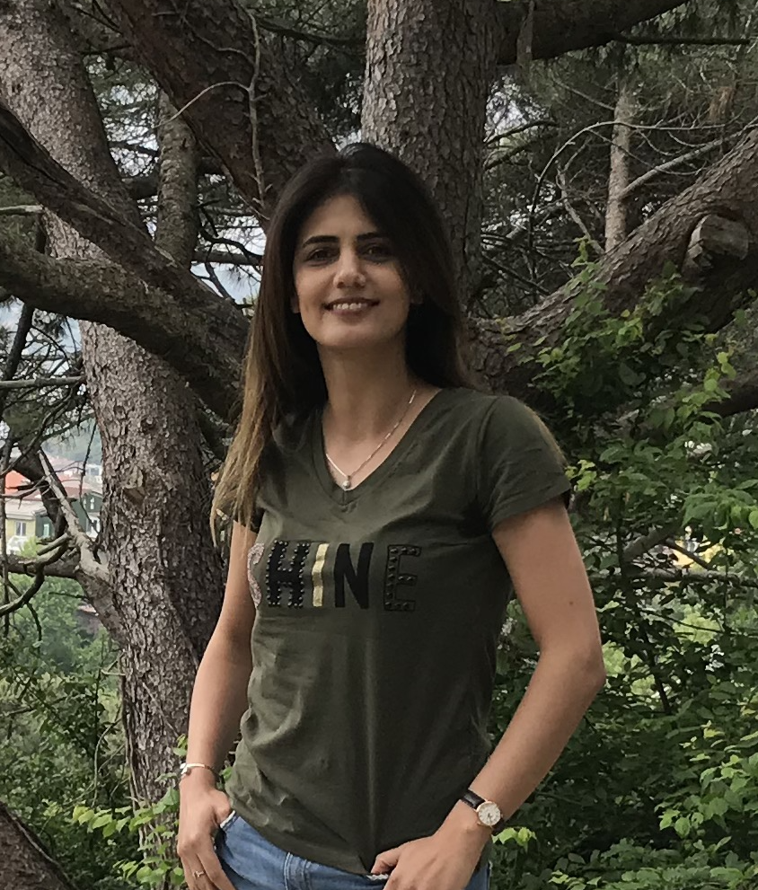

## Welcome to my Page
<!-- Link Sample-->
<!-- <a href="https://nananasiri.github.io/Nahid-Nasiri/Nahid_Nasiri_CV.pdf">MyCV</a> -->

<input class="MyButton" onclick="window.location.href='https://nananasiri.github.io/Nahid-Nasiri/Nahid_Nasiri_CV.pdf'" type="button" value="CV" />        <input class="MyButton" onclick="window.location.href='https://nananasiri.github.io/Nahid-Nasiri/about.html'" type="button" value="about" />       <input class="MyButton" onclick="window.location.href='https://scholar.google.com.tr/citations?user=NeInNdQAAAAJ&hl=en&oi=ao'" type="button" value="Publications"/>




<p align=left> I am a first-year graduate student at the University of California at Santa Cruz, majoring in Computer Engineering. My research area relies on a medical imaging instrument PET scanner, producing vast amounts of raw data that must be transformed into images for clinicians’ interpretation. This process, known as image reconstruction, can be enhanced and improved with modern computational techniques and machine learning. My goal is to utilize state-of-the-art in deep learning to enhance the system’s sensitivity and quality of images.</p>
<!-- 
```

# Header 1
## Header 2

- Bulleted
- List

1. Numbered
2. List

**Bold** and _Italic_ and `Code` text

[Link](url) and 


For more details see [GitHub Flavored Markdown](https://guides.github.com/features/mastering-markdown/).

### Jekyll Themes

Your Pages site will use the layout and styles from the Jekyll theme you have selected in your [repository settings](https://github.com/nananasiri/test/settings). The name of this theme is saved in the Jekyll `_config.yml` configuration file.

### Support or Contact

Having trouble with Pages? Check out our [documentation](https://docs.github.com/categories/github-pages-basics/) or [contact support](https://support.github.com/contact) and we’ll help you sort it out.

-->
