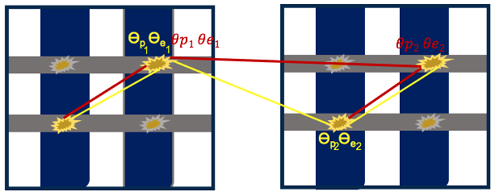
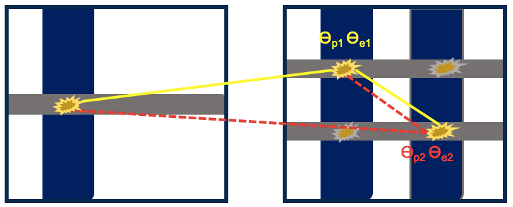
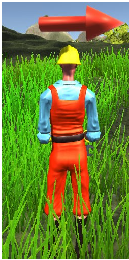
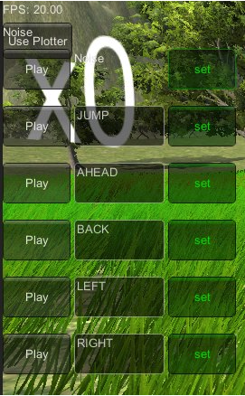

## Welcome to my Page
<!-- Link Sample-->
<!-- <a href="https://nananasiri.github.io/Nahid-Nasiri/Nahid_Nasiri_CV.pdf">MyCV</a> -->

<input class="MyButton" onclick="window.location.href='https://nananasiri.github.io/Nahid-Nasiri/Nahid_Nasiri_CV.pdf'" type="button" value="CV" />       <!-- <input class="MyButton" onclick="window.location.href='https://nananasiri.github.io/Nahid-Nasiri/about.html'" type="button" value="about" />  -->     <input class="MyButton" onclick="window.location.href='https://scholar.google.com.tr/citations?user=NeInNdQAAAAJ&hl=en&oi=ao'" type="button" value="Publications"/> <input class="MyButton" onclick="window.location.href='https://www.linkedin.com/feed/'" type="button" value="Linkdin"/> <input class="MyButton" onclick="window.location.href='https://nananasiri.github.io/Nahid-Nasiri/about.html'" type="button" value="events" /> 


 

<h1>About Me</h1>

<p align=left> I am a first-year graduate student at the University of California at Santa Cruz, majoring in Computer Engineering. My research area relies on a medical imaging instrument PET scanner, producing vast amounts of raw data that must be transformed into images for clinicians’ interpretation. This process, known as image reconstruction, can be enhanced and improved with modern computational techniques and machine learning. My goal is to utilize state-of-the-art in deep learning to enhance the system’s sensitivity and quality of images.</p>

<h1>Publications</h1>
<h5>A deep learning approach to correctly identify the sequence of coincidences in cross-strip CZT detectors</h5>



<p align=left> Intra-detector scatters (IRS) and Inter-detector scatters (IDS) are events that often happen in positron emission tomography (PET) due to the Compton scattering of an annihilation photon inside one detector block and also from one detector block to another. One challenge in PET system based on Cadmium zinc telluride (CZT) detectors is the high mass attenuation coefficient for Compton scattering at 511 keV that causes a considerable fraction of Multiple Interaction Photon Events (MIPEs). Besides, in a cross strip CZT detector, there is more ambiguity in pairing anode with its corresponding cathode in MIPEs in IRS. This study utilizes state-of-the-art deep learning to identify target sequences in cross-strip CZT detectors correctly. It is promising to improve the system's sensitivity by identifying true line-of-responses (LOR)s out of different possible LORs from IRS events, IDS events and Intra-detector ambiguity usually discarded. 
<input class="MyButton" onclick="window.location.href='https://www.researchgate.net/publication/349321640_A_deep_learning_approach_to_correctly_identify_the_sequence_of_coincidences_in_cross-strip_CZT_detectors'" type="button" value="Link to the publication"/> </p>

<h5>A serious game for children with speech disorders and hearing problems</h5>
 
<p align=left> Speech  impediment  affecting  children  with  hearingdifficulties  and  speech  disorders  requires  speech  therapy  andmuch practice to overcome. To motivate the children to practicemore,  serious  games  can  be  used  because  children  are  moreinclined  to  play  games.  In  this  paper,  we  have  designed  andimplemented  a  serious  game  in  which  children  can  learn  tospeak  specific  words  that  they  are  expected  to  know  beforethe age of 7. The game consists of an avatar controlled by thechild through speech, with the objective of moving the avatararound the environment to earn coins. The avatar is controlledby  voice  commands  such  as  Jump,  Ahead,  Back,  Left,  Right.Children will be guided by an arrow during the game insteadof  a  getting  help  from  a  therapist  or  a  teacher  to  guide  thechild to the next coin. This allows the child to practice longerhours, compared to clinical approaches under the supervisionof  a  therapist,  which  are  time-limited.
<input class="MyButton" onclick="window.location.href='https://www.researchgate.net/publication/317420765_A_serious_game_for_children_with_speech_disorders_and_hearing_problems'" type="button" value="Link to the publication"/> </p>
  
  

<!-- 
```

# Header 1
## Header 2

- Bulleted
- List

1. Numbered
2. List

**Bold** and _Italic_ and `Code` text

[Link](url) and 


For more details see [GitHub Flavored Markdown](https://guides.github.com/features/mastering-markdown/).

### Jekyll Themes

Your Pages site will use the layout and styles from the Jekyll theme you have selected in your [repository settings](https://github.com/nananasiri/test/settings). The name of this theme is saved in the Jekyll `_config.yml` configuration file.

### Support or Contact

Having trouble with Pages? Check out our [documentation](https://docs.github.com/categories/github-pages-basics/) or [contact support](https://support.github.com/contact) and we’ll help you sort it out.

-->
